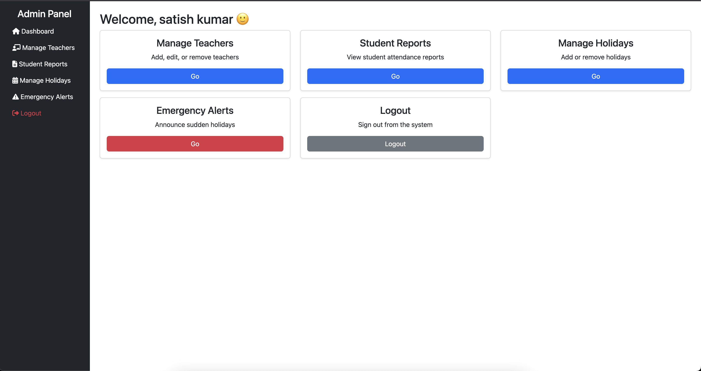
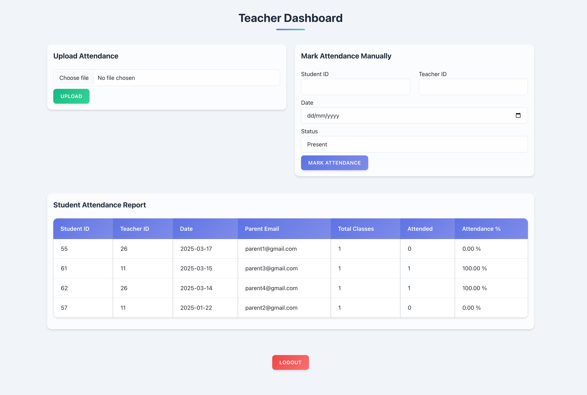
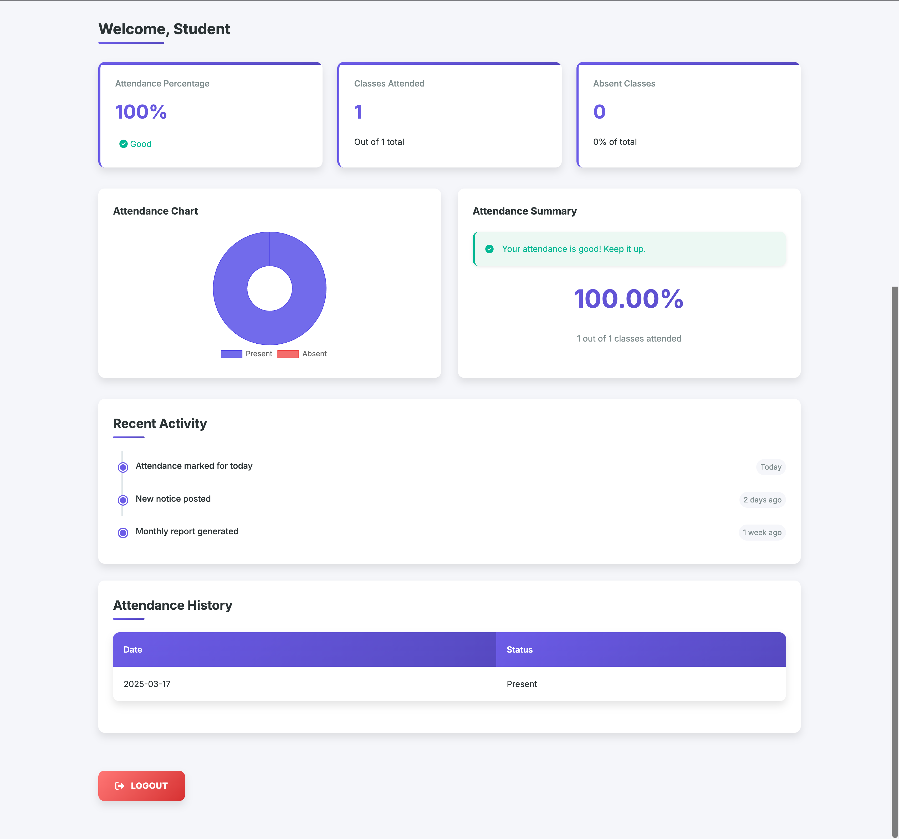

# Student Attendance Management System

## Overview
An AI-powered web-based attendance management system featuring facial recognition for automated attendance tracking. The system supports three user roles: **Admin**, **Teacher**, and **Student**, each with role-specific dashboards and functionalities.

## Key Features

### 🎯 AI-Powered Face Recognition
- **Face Enrollment**: Register student faces through admin panel
- **Live Self-Attendance**: Students mark attendance using webcam with blink detection for liveness verification
- **Classroom Attendance**: Teachers upload classroom photos for automatic batch attendance marking
- **Mock Mode Support**: System can run without AI libraries for testing (returns dummy data)

### 👨‍💼 Admin Section


- User management (add/remove teachers and students)
- Face enrollment system for students
- Declare holidays and send emergency alerts
- View comprehensive attendance reports
- Automated email notifications to parents
- Audit logging for all system actions

### 👩‍🏫 Teacher Section


- Mark attendance manually or via Excel upload
- Classroom photo attendance (AI-powered batch recognition)
- Automatic attendance percentage calculation
- Warning emails for students below 75% attendance
- View student attendance analytics

### 👨‍🎓 Student Section


- Live self-attendance with webcam (face + blink verification)
- View personal attendance records and statistics
- Receive email notifications for low attendance
- Access to holiday and alert announcements

## Technology Stack

### Backend
- **Java 8** - Core application logic
- **Servlet/JSP** - Web application framework
- **Hibernate 5.6** - ORM for database operations
- **Maven** - Dependency management and build tool
- **Apache Tomcat 9** - Application server

### Frontend
- **HTML5/CSS3** - Structure and styling
- **JavaScript** - Client-side interactivity
- **Bootstrap** - Responsive UI framework
- **AJAX** - Asynchronous requests

### AI/ML Services
- **Python 3.13** - AI service runtime
- **Flask** - Python web framework
- **OpenCV** - Image processing
- **face_recognition** - Face detection and encoding (based on dlib)
- **NumPy** - Numerical computations

### Database
- **PostgreSQL** - Primary database
- Schema includes: users, students, teachers, attendance records, face data, audit logs

### Security
- **BCrypt** password hashing
- Session-based authentication
- Role-based access control (RBAC)
- CSRF protection

## Architecture

```
┌─────────────────┐         ┌──────────────────┐
│   Web Browser   │ ◄─────► │  Tomcat Server   │
│   (Frontend)    │         │  (Java Backend)  │
└─────────────────┘         └────────┬─────────┘
                                     │
                                     │ HTTP
                                     ▼
                            ┌─────────────────┐
                            │  Python AI      │
                            │  Service :5000  │
                            └─────────────────┘
                                     │
                                     ▼
                            ┌─────────────────┐
                            │   PostgreSQL    │
                            │    Database     │
                            └─────────────────┘
```

## Installation and Setup

### Prerequisites
- Java 8 or higher
- Maven 3.6+
- PostgreSQL 12+
- Python 3.8+
- (Optional) cmake - Required for full AI functionality

### 1. Clone the Repository
```bash
git clone https://github.com/samiralam04/StudentAttendanceManagementSystem.git
cd StudentAttendanceManagementSystem
```

### 2. Database Setup
```bash
# Create PostgreSQL database
createdb attendance_db

# Update database credentials in:
# src/main/resources/hibernate.cfg.xml
```

### 3. Python AI Service Setup
```bash
cd python_services

# Create virtual environment
python3 -m venv venv

# Activate virtual environment
source venv/bin/activate  # On macOS/Linux
# OR
venv\Scripts\activate     # On Windows

# Install dependencies
pip install -r requirements.txt

# For full AI functionality (optional):
# Install cmake first
brew install cmake  # macOS
# OR
sudo apt-get install cmake  # Ubuntu/Debian

# Then install face_recognition
pip install face_recognition
```

### 4. Start Python AI Service
```bash
# From python_services directory
./start_python_service.sh

# Service will start on http://localhost:5000
# Verify with: curl http://localhost:5000/health
```

### 5. Build and Deploy Java Application
```bash
# From project root directory
mvn clean package cargo:run

# Application will start on http://localhost:8080
# Access at: http://localhost:8080/StudentAttendanceManagementSystem
```

## Running the Application

### Start Both Services
1. **Python AI Service** (Terminal 1):
   ```bash
   cd python_services
   ./start_python_service.sh
   ```

2. **Java Application** (Terminal 2):
   ```bash
   mvn cargo:run
   ```

### Access Points
- **Main Application**: http://localhost:8080/StudentAttendanceManagementSystem
- **Python AI Service**: http://localhost:5000 (internal use only)

### Default Login Credentials
Create admin account through registration page, then use admin panel to add teachers and students.

## API Endpoints (Python Service)

| Endpoint | Method | Purpose |
|----------|--------|---------|
| `/enroll-face` | POST | Enroll student face, returns 128-d encoding |
| `/verify-live-student` | POST | Verify identity + liveness (blink detection) |
| `/recognize-class` | POST | Batch face recognition from classroom photo |
| `/health` | GET | Health check endpoint |

## Project Structure
```
StudentAttendanceManagementSystem/
├── src/
│   ├── main/
│   │   ├── java/com/attendance/
│   │   │   ├── controller/     # Servlets
│   │   │   ├── dao/            # Database access
│   │   │   ├── entity/         # JPA entities
│   │   │   ├── service/        # Business logic
│   │   │   └── util/           # Utilities
│   │   ├── resources/
│   │   │   └── hibernate.cfg.xml
│   │   └── webapp/
│   │       ├── pages/          # JSP pages
│   │       ├── css/            # Stylesheets
│   │       ├── js/             # JavaScript
│   │       └── WEB-INF/
│   └── test/                   # Unit tests
├── python_services/
│   ├── app.py                  # Flask application
│   ├── requirements.txt        # Python dependencies
│   ├── start_python_service.sh # Startup script
│   └── venv/                   # Virtual environment
├── pom.xml                     # Maven configuration
└── README.md
```

## Troubleshooting

### Python Service Issues
**Problem**: "Python service unreachable"
- Ensure Python service is running: `ps aux | grep app.py`
- Check port 5000 is available: `lsof -i :5000`
- Restart service: `pkill -f app.py && ./start_python_service.sh`

**Problem**: "AI libraries not available"
- This is expected if cmake/face_recognition isn't installed
- System runs in mock mode (returns dummy encodings)
- For full AI: Install cmake, then `pip install face_recognition`

### Java Application Issues
**Problem**: "Port 8080 already in use"
- Kill existing process: `lsof -ti:8080 | xargs kill -9`
- Restart: `mvn cargo:run`

**Problem**: "Database connection failed"
- Verify PostgreSQL is running
- Check credentials in `hibernate.cfg.xml`
- Ensure database exists: `psql -l | grep attendance_db`

## Features in Detail

### Face Enrollment Process
1. Admin selects student from dropdown
2. Student uploads clear face photo
3. Python service extracts 128-dimensional face encoding
4. Encoding stored in database for future matching

### Live Self-Attendance
1. Student clicks "Mark Attendance"
2. Webcam captures live photo
3. System verifies face matches enrolled encoding
4. Blink detection confirms liveness (prevents photo spoofing)
5. Attendance marked automatically

### Classroom Attendance
1. Teacher uploads classroom photo
2. Python service detects all faces
3. Matches against enrolled student encodings
4. Returns list of present students
5. Attendance records created in batch

## Contributing
Contributions are welcome! Please:
1. Fork the repository
2. Create a feature branch (`git checkout -b feature/amazing-feature`)
3. Commit changes (`git commit -m 'Add amazing feature'`)
4. Push to branch (`git push origin feature/amazing-feature`)
5. Open a Pull Request

## License
This project is licensed under the MIT License.
© 2025 Samir Alam. All rights reserved.

## Contact
**Developer**: Samir Alam  
**Year**: 2025

Feel free to reach out for suggestions, collaborations, or support.

---
**Note**: For full AI functionality, install `cmake` and `face_recognition`. Otherwise, the system runs in mock mode for testing purposes.
