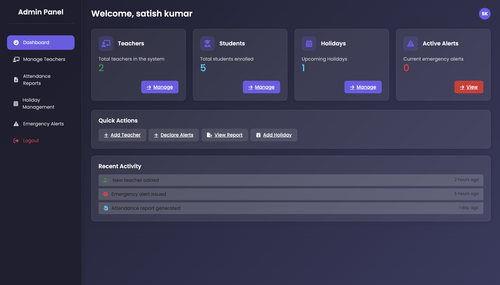
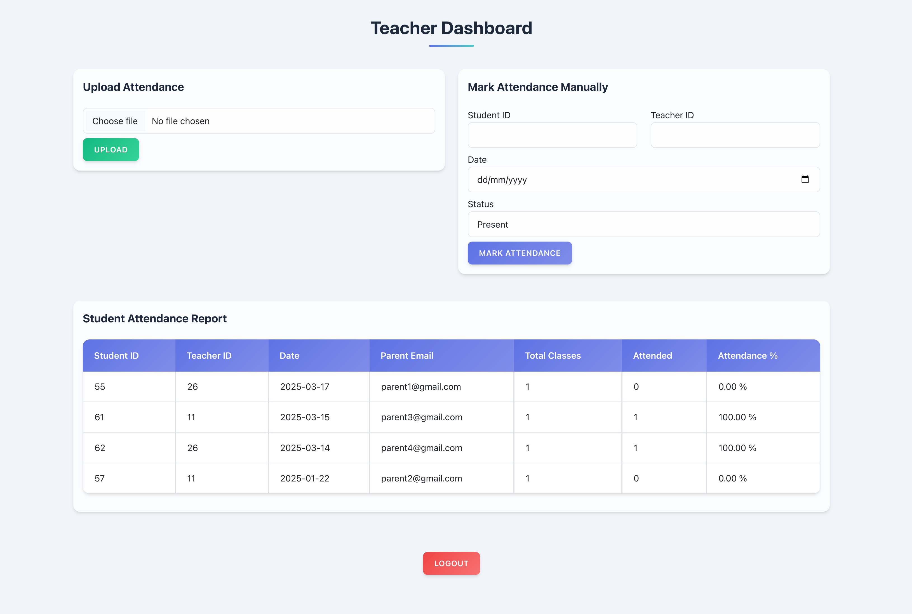

# Student Attendance Management System

## Overview
The Student Attendance Management System is a web-based application designed to streamline attendance tracking and management in educational institutions. It features three user roles: **Admin**, **Teacher**, and **Student/Parent**. Each role has unique access permissions and functionalities to enhance efficiency and transparency.

## Features

### Admin Section


- Login and Register as Admin.
- Add or remove teachers.
- Declare holidays and send emergency alerts.
- View student attendance reports.
- Automatically send holiday and alert notifications to parents' emails.

### Teacher Section


- Login and Register as Teacher.
- Upload attendance via Excel file or mark attendance manually.
- Automatically calculate attendance percentage after uploading Excel file.
- Automatically send warning emails to parents if attendance falls below 75%.

### Student/Parent Section


- Login and Register as Student or Parent.
- View attendance records.
- Receive email notifications for holidays, alerts, and low attendance warnings.

## Technologies Used
- **Backend:** [Java](https://www.oracle.com/java/), [Servlet](https://docs.oracle.com/javaee/7/tutorial/servlets.htm), [JSP](https://docs.oracle.com/javaee/7/tutorial/jsf-intro.htm)
- **Server:** [Tomcat 9](http://tomcat.apache.org/)
- **Frontend:** [HTML](https://developer.mozilla.org/en-US/docs/Web/HTML), [CSS](https://developer.mozilla.org/en-US/docs/Web/CSS), [Bootstrap](https://getbootstrap.com/), [AJAX](https://developer.mozilla.org/en-US/docs/Web/Guide/AJAX)
- **Database:** [PostgreSQL](https://www.postgresql.org/)
- **Version Control:** [GitHub](https://github.com/)
- **Security:** [Password Hashing](https://www.baeldung.com/java-password-hashing), [Session Management](https://docs.oracle.com/javaee/7/tutorial/servletsession.html)

## Installation and Setup
1. Clone the repository:
   ```bash
   git clone https://github.com/yourusername/StudentAttendanceManagementSystem.git
   ```
2. Import the project into your IDE (e.g., Eclipse or IntelliJ).
3. Set up PostgreSQL and configure the database connection in `web.xml`.
4. Deploy the project on Tomcat 9 server.
5. Access the application at:
   ```
   http://localhost:8080/StudentAttendanceManagementSystem
   ```

## Usage Instructions
- Admin can add teachers, declare holidays, and view attendance reports.
- Teachers can upload attendance or mark it manually.
- Students and parents can view attendance records and receive alerts.

## Contributing
Contributions are welcome! Feel free to open issues or submit pull requests.

## License
This project is licensed under the MIT License.
© 2025 Samir Alam. All rights reserved.

## Contact
Developed by Samir Alam, 2025.
Feel free to reach out for suggestions or collaborations.

